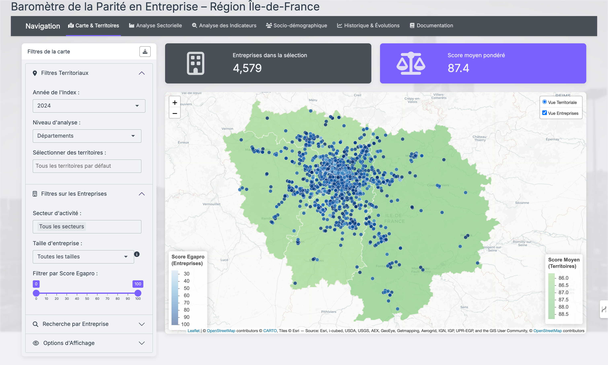

<!-- Language Navigation -->
<div align="right">
  <b><a href="./README.md">English</a></b> | <a href="./README_fr.md">Français</a> | <a href="./README_es.md">Español</a>
</div>

# Gender Equality Dashboard - Île-de-France

[](https://opensource.org/licenses/MIT)


[](https://alespfer.shinyapps.io/barometre-parite-idf/)

An interactive web application built with **R** and **Shiny** to analyze and visualize professional gender equality data for the Île-de-France region (Paris and its surroundings). This dashboard uses public data from the French "Egapro Index" to provide territorial and sectoral insights for public policymakers, economic development agencies, and researchers.

**[➡️ View the Deployed Application](https://alespfer.shinyapps.io/barometre-parite-idf/)**



## Table of Contents

- [About The Project](#about-the-project)
- [Key Features](#key-features)
- [Data Pipeline & Automation](#data-pipeline--automation)
- [Built With](#built-with)
- [Getting Started](#getting-started)
  - [Prerequisites](#prerequisites)
  - [Installation](#installation)
- [Usage](#usage)
- [License](#license)
- [Contact](#contact)

## About The Project

Since 2018, French companies with more than 50 employees are required to calculate and publish their **"Egapro" Gender Equality Index**. This index, scored out of 100, is a key tool in measuring and reducing gender inequalities in the workplace. It is based on five indicators:
- Gender pay gap (40 points)
- Gap in individual salary increases (20-35 points)
- Gap in promotion rates (15 points)
- Salary increases for employees returning from maternity leave (15 points)
- Parity among the 10 highest-paid employees (10 points)

While this data is public, its analysis is often limited to a national level. This project was developed to offer a **territorial perspective** within the Île-de-France region, enabling detailed analysis at the department, inter-municipality (EPCI), and employment area (Zone d'Emploi) levels.

## Key Features

The dashboard is organized into several analytical modules:

*   🗺️ **Map & Territories:** An interactive map to visualize the average Egapro scores across different administrative and economic territories. Users can filter by year, company size, and business sector, and search for specific companies by their SIREN number.
*   📊 **Sector Analysis:** A lollipop chart that highlights the best and worst-performing business sectors. This module is interactive: clicking on a sector filters the main map for deeper exploration.
*   🔍 **Indicator Analysis:** A drill-down module to analyze performance on each of the five individual indicators that make up the global Egapro score.
*   📈 **Socio-Demographic Analysis:** An exploratory tool to visualize potential correlations between company performance and the socio-economic context of their employment area (e.g., female activity rate, share of women in executive positions).
*   📉 **Historical Trends:** A time-series analysis module to track and compare the evolution of Egapro scores over several years for selected territories.

## Data Pipeline & Automation

To ensure the data is always up-to-date and reliable, the project features a fully automated data processing pipeline using **GitHub Actions**.


1.  **Data Extraction:** A scheduled workflow (`.github/workflows/data-pipeline.yml`) runs monthly. It fetches the latest data from multiple public APIs:
    *   **Egapro Index:** from `data.gouv.fr`
    *   **SIRENE database (company info):** from `Opendatasoft`
    *   **Census Data (socio-demographics):** from INSEE (local files)
2.  **Data Transformation:** The `run_pipeline.R` script cleans, standardizes, enriches, and merges these datasets into a final master table. Key steps include geo-localization of company headquarters, NAF code to business sector mapping, and calculation of socio-demographic indicators.
3.  **Loading for Shiny:** The processed data is saved as optimized `.RDS` files in the `data_shiny/` directory. The Shiny app reads these files directly, ensuring fast loading times and high reactivity.
4.  **Continuous Deployment:** A second GitHub Actions workflow (`.github/workflows/deploy-shinyapp.yml`) automatically re-deploys the application to `shinyapps.io` whenever changes are pushed to the `main` branch, including the automated data updates.

## Built With

This project relies on a modern R Tidyverse and spatial analysis ecosystem:

*   **Core:** [R](https://www.r-project.org/), [Shiny](https://shiny.posit.co/)
*   **UI/UX:** [{bslib}](https://rstudio.github.io/bslib/) for Bootstrap 5 theming, [{plotly}](https://plotly.com/r/) for interactive charts
*   **Data Manipulation:** [{dplyr}](https://dplyr.tidyverse.org/), [{tidyr}](https://tidyr.tidyverse.org/)
*   **Spatial Analysis & Mapping:** [{sf}](https://r-spatial.github.io/sf/), [{leaflet}](https://rstudio.github.io/leaflet/)
*   **Reproducibility:** [{renv}](https://rstudio.github.io/renv/) for dependency management

## Getting Started

To run this project locally, follow these steps.

### Prerequisites

*   R (version 4.2 or higher)
*   RStudio is recommended for the best experience.

### Installation

1.  Clone the repository:
    ```bash
    git clone https://github.com/Alespfer/barometre-parite-idf.git
    ```
2.  Navigate to the project directory:
    ```bash
    cd barometre-parite-idf
    ```
3.  Open the `egapro.Rproj` file in RStudio.
4.  The `{renv}` package will automatically restore the project's dependencies from the `renv.lock` file. If prompted, type `renv::restore()` in the console and confirm. This will install all required packages in a project-specific library.
5.  If you need to run the data pipeline yourself, you will need to download the INSEE census files specified in `methodologie_preparation_donnees.Rmd` and place them in the `data/raw/` directory. Otherwise, the pre-processed data is already available in `data_shiny/`.

## Usage

Once the dependencies are installed, you can run the application by opening the `app.R` file and clicking "Run App" in RStudio, or by executing the following command in the R console:

```R
shiny::runApp('app.R')
```

## License

This project is distributed under the MIT License. See the `LICENSE` file for more information.

## Contact

Alberto Esperon - [LinkedIn](https://www.linkedin.com/in/alberto-espfer) - [GitHub Profile](https://github.com/Alespfer)

Project Link: [https://github.com/Alespfer/barometre-parite-idf](https://github.com/Alespfer/barometre-parite-idf)
